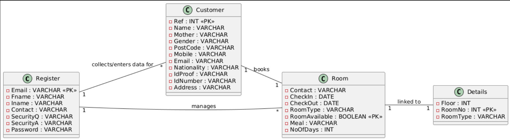
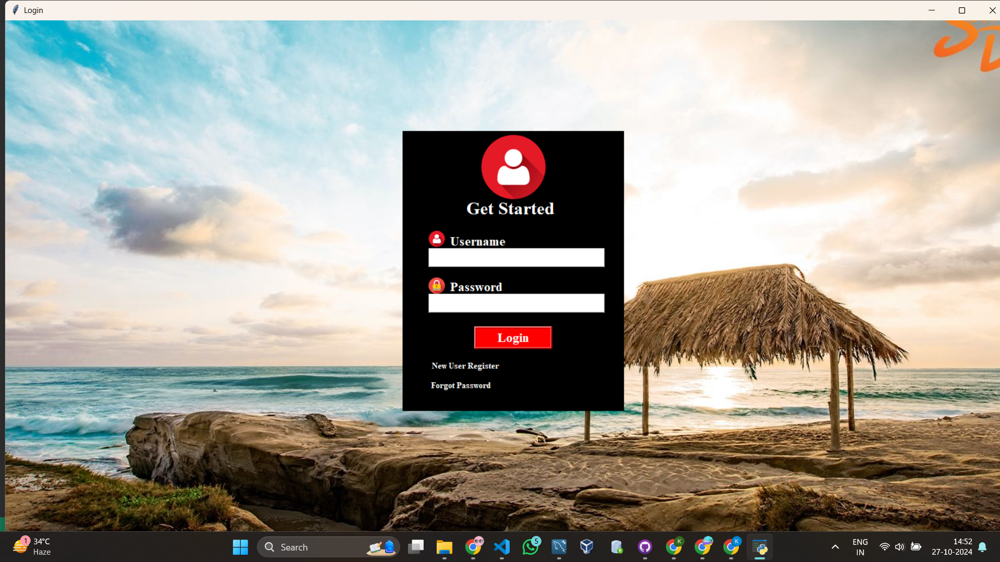
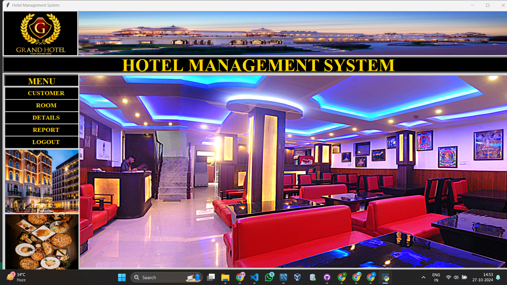
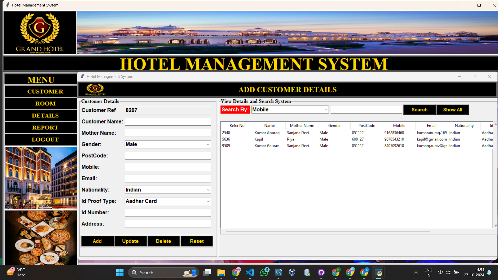
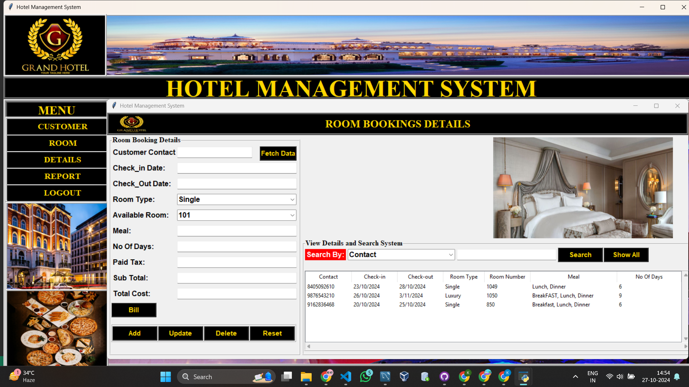

# Hotel Management System

This project is designed to manage hotel operations, including room bookings and meal services, as part of a demonstration project.

## Table of Contents

- [Project Description](#project-description)
- [Basic Structure](#basic-structure)
- [Functionalities](#functionalities)
- [ER Diagram](#er-diagram)
- [Screenshots of the Interface](#screenshots-of-the-implementation)
- [Tech Stack](#tech-stack)
- [How to Run](#how-to-run)

## Project Description

The Hotel Management System provides a user-friendly interface for managing room bookings and meal services. This project aims to streamline hotel operations by offering an efficient way to handle room types, meal options, and billing calculations while utilizing a MySQL database for data storage.

## Basic Structure

### Functionalities

#### User Authentication

- All users can securely log in and log out of the system.

#### Employee

- can login.
- can view details of rooms, meals, and bookings.
- can manage customers.
- can view all bookings.
- can manage room cleaning schedules.
- can see total number of bookings.

#### Customer

- can view available rooms.
- can book a room.
- can select meal options.
- can view booking details.
- can see and pay for their bookings.

## ER Diagram



## Screenshots of the Implementation

### Login Dashboard



### Home Page Dashboard



### Customer Dashboard



### Room Dashboard



## Tech Stack

- **Frontend**: Tkinter
- **Backend**: Python
- **Database**: MySQL

## How to Run

1. First, clone the GitHub repo:
   ```bash
   git clone https://github.com/yourusername/hotel-management-system.git
   ```
